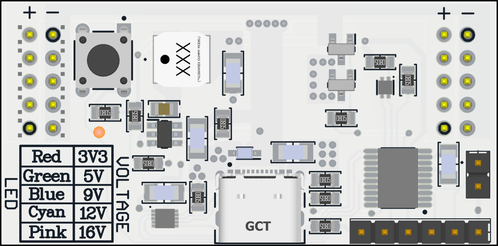
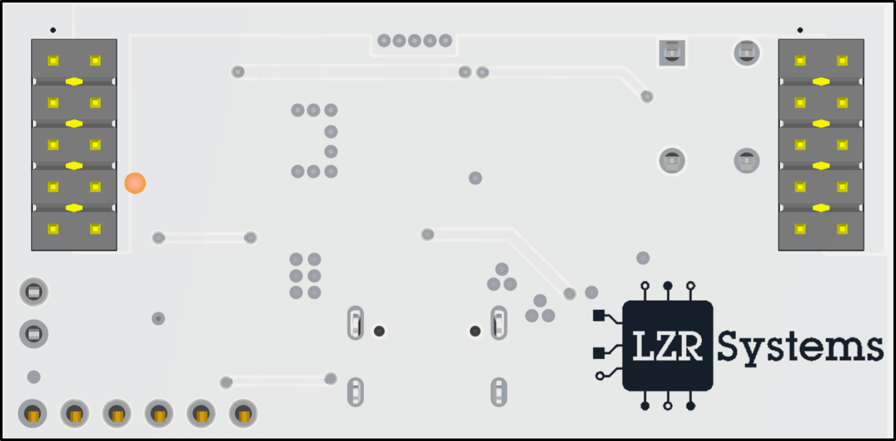

### BreadboardPSU is a solderless breadboard compatible programmable power supply based on the USB PD PPS protocol

## ✈️Features
- **5 Selectable voltage outputs: 3.3V, 5V, 9V, 12V, 16V**
- **Single button UI** (no jumpers)
- **USB-C input**
- **RGB LED feedback**
- **Reverse current protection**
- **Fully customizable Voltage table and debug via SWIO & UART headers**

## ⚙️Hardware
 **Microcontroller: CH32V006F8P6**
 - 32-bit RISC-V core
 - 24MHz internal RC oscillator
 - 8kB SRAM
 - 62kB PROGMEM
 - 8 channel 12-bit ADC
 - 14 I/O port
 - I2C, SPI, UART
 - Debug: 1-wire SWIO
 - Package: TSSOP-20

**USB PD Sink Controller: CH224Q**
- USB PD 3.0/3.2, EPR, PPS, SPR
- 100W(PD 3.0), 140W(PD 3.2)
- Config: 
    - 400kHz I2C
    - Single resistor on CFG1 pin
    - CFG1/2/3 logic-level selection
-  Over-voltage protection

**Dual PMV20XNER NMOS for reverse current protection & Vout EN**

**DCP3601NMR Buck converter for MCU power/logic rail**

**CLMUD-FKC RGB LED**

**2x 2x05 2.54 pitch header for breadboard connection**

## 🚀 Quick start
### ❗Disclaimer: Breadboards have limited current capacity. Keep continuous current conservative (e.g., ≤ 1 A per rail unless you know your setup)
1. Plug a USB-C PPS capable charger/power bank into the board
2. Short-press the button to enable/disable the output
3. Long-press the button to cycle outputs: 3.3V → 5V → 9V → 12V → 16V
4. RGB LED indicates state/voltage (see table below):

| Voltage | LED color   |
| ------- |  ---------  |
| **3.3 V**   | $${\color{red}RED}$$       |
| **5 V**     | $${\color{green}GREEN}$$   |
| **9 V**     | $${\color{blue}BLUE}$$     |
| **12 V**    | $${\color{cyan}CYAN}$$     |
| **16 V**    | $${\color{pink}PINK}$$     |

## ☢️Safety
- ### **Max theoretical output current: 3A(limited by TjFET )**
- ### **Bench-test with current-limited supply first**
- ### **Breadboard contacts can overheat; watch temperature at > 1 A**
- ### **Device defaults to 3.3V upon loss of power/restart**

## 🔜Code
### Still waiting for board, stay tuned

## 📝Schematic

## 🧰PCB 3D Render

## 💾Repository Contents
- `*.SchDoc` - Altium schematic files  
- `*.PcbDoc` - Altium PCB file  
- `GERBER/` - Gerber outputs (for fabrication)  
- `Pictures/` - Schematics and board previews (SVG, PNG)
- `Docs/` - Datasheets (WCH CH32, auto-translated CH224Q)